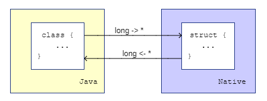

# olca-umfact
This is a small library that supports to pass around pointers to factorized
[UMFPACK](https://github.com/PetterS/SuiteSparse/tree/master/UMFPACK) matrices
between Java and native code. The glue code is written in C but we may want
to rewrite this experiment in Rust so that we can integrate this into
[olca-rust](https://github.com/msrocka/olca-rust).

The idea is to allocate a factorized matrix on the native site and return
the pointer to the Java site:



For Rust, returning a pointer to a Box as described here could work:
https://codereview.stackexchange.com/a/223754

## Building from source
On Windows, you first want to setup MinGW 64 bit tool chain. Just go to
https://sourceforge.net/projects/mingw-w64/files and follow the path with the
most downloads (posix threads etc.). Exctract it and modify the `build*.bat`
scripts so that they point to the correct folders.

We link to the [olca-rust](https://github.com/msrocka/olca-rust) libraries
which you need to put into the `libs` folder of this project. And of course,
you need to have a JDK and Maven installed.

## Usage

Add the following dependency to your project:

```xml
<dependency>
  <groupId>org.openlca</groupId>
  <artifactId>olca-umfact</artifactId>
  <version>0.1.0</version>
</dependency>
```

Load the `olca-umfact` library and its dependencies from a folder:

```java
Umfact.load(new File("path to folder"));
```

```java
IMatrix A = ...;
UmfactMatrix F = Umfact.factorize(CSCMatrix.of(A));
double[] s = Umfact.solve(F, d);
```
